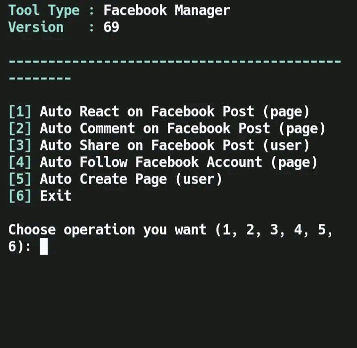
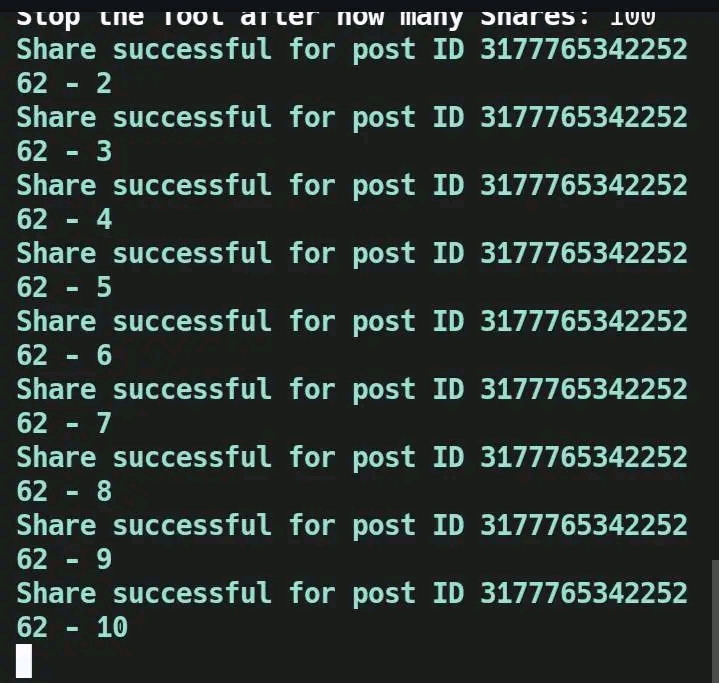

# 📰 HOW TO USE?

```python
pkg update
```
```python
pkg upgrade
```
```python
pkg install git
```
```python
git clone https://github.com/eldwincabanilla2/Tools
```
```python
cd Tools
```
```python
cd tools
```
```python
python tools.py
```

# 📷 SCREENSHOTS

</img>
</img>

